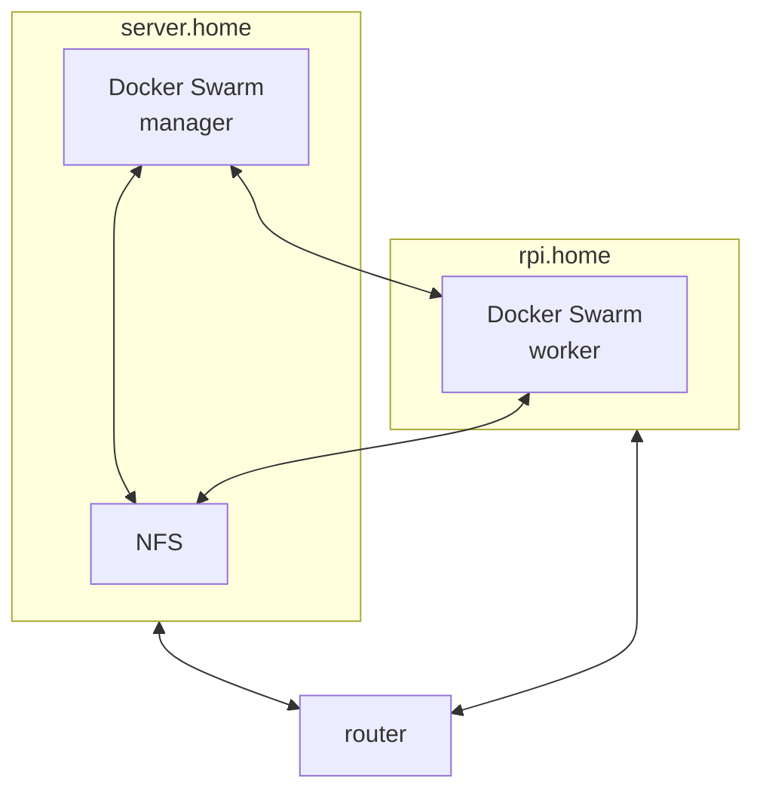

# Home Server

Current setup is based on x86_64 laptop with Alpine Linux and Raspberry Pi 3B+ with Raspberry Pi OS



## Alpine Linux

Alpine linux must be installed in SYS mode  
In that example we assuming that system has user account other than root

---

```sh
su
```
As root:
```sh
sed -i 's/#\(.*\/community\)/\1/' /etc/apk/repositories
apk add sudo curl zsh git tmux nano htop

echo '%wheel ALL=(ALL) ALL' > /etc/sudoers.d/wheel
adduser %username% wheel
```
---
As user: 
```sh
# Installing Oh My Zsh
sh -c "$(curl -fsSL https://raw.githubusercontent.com/ohmyzsh/ohmyzsh/master/tools/install.sh)"

sudo nano /etc/passwd
```
Change /bin/ash to /bin/zsh for your user

## Install NFS
```sh
sudo apk add nfs-utils
sudo rc-update add nfs
sudo service nfs start
```

## NFS shares
```sh
sudo ln -s <path_to_shared> /mnt/shared

sudo nano /etc/exports
```
Add line
```
/mnt/shared 192.168.1.0/24(rw,no_subtree_check)
```
```sh
sudo exportfs -a
```


---
## Install docker
```sh
sudo apk add docker docker-compose
sudo addgroup $USER docker
sudo rc-update add docker default
sudo service docker start

# Theoretically after reboot you
# will able to use docker without sudo

# Test installation
sudo docker run --rm hello-world

# Put docker in to swarm mode
sudo docker swarm init
```
---
## Install Portainer  
https://docs.portainer.io/start/install-ce/server/swarm/linux

---
## Create networks
```sh
docker network create --scope=swarm --attachable -d overlay nginx
docker network create --scope=swarm --attachable -d overlay databases
```
Then connect portainer_portainer service to nginx network via Portainer UI

---
## Create volumes
```sh
docker volume create backup_config
docker volume create backup_data
docker volume create shared
docker volume create nginx_data
docker volume create nginx_letsencrypt
docker volume create transmission_config
docker volume create samba_data
docker volume create mariadb_data
docker volume create postgres_data
docker volume create redis_data
docker volume create firefly_upload
docker volume create nextcloud_config
docker volume create nextcloud_data
docker volume create authentik_media
docker volume create authentik_certs
docker volume create authentik_templates
docker volume create jellyfin_config
docker volume create lidarr_config
docker volume create readarr_config
docker volume create prowlarr_config
```
---

## Create secrets  

`transmission_password`  
`mariadb_password`  
`postgres_password`  
`backup_password`  
`firefly_app_key` - 32 characters, no special symbols  
`firefly_cron_token` - 32 characters, no special symbols  
`authentik_secret_key` - pwgen -s 50 1  


---

## Stacks

Add all your stacks to Portainer via link to repository  
Don't forget to setup GitOps updates

### Samba
You need to create samba config before deploy stack
```yaml
# /var/lib/docker/volumes/samba_data/_data/config.yml 

auth:
  - user: <username>
    group: <username>
    uid: 1000
    gid: 1000
    password: changeme

global:
  - "force user = <username>"
  - "force group = <username>"

share:
  - name: shared
    comment: Public
    path: /samba/shared
    browsable: yes
    readonly: no
    guestok: yes


```

---
